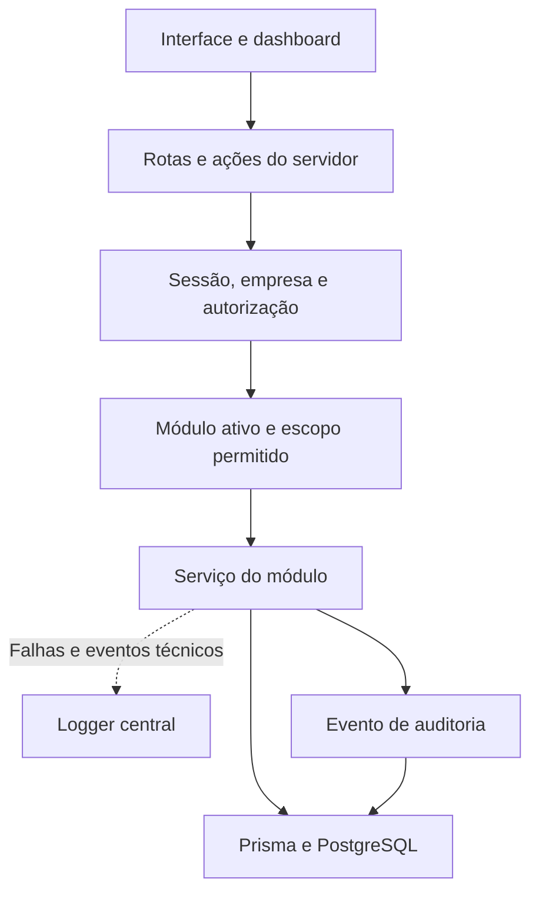
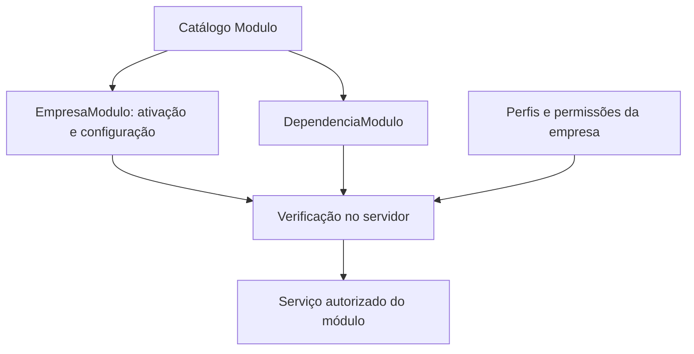
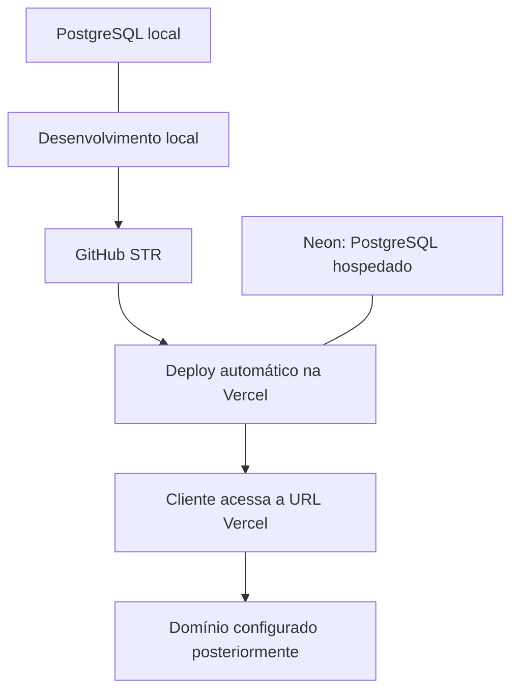

# MProj — Arquitetura de referência v1

STR Software • Sprint 1 • 03/10/2026

Este documento orienta a produção do MProj. A arquitetura definida e a implementação existente são estados diferentes: os diagramas mostram o destino do sistema; as tabelas registram as evidências disponíveis. Atualizar este documento quando uma decisão estrutural mudar e registrar o resultado nos checkpoints.

## 1. Estado confirmado

| Componente | Estado | Evidência ou limite |
| --- | --- | --- |
| PostgreSQL local | Aplicado | PostgreSQL 17; bancos mproj_dev e mproj_shadow; usuário próprio sem superusuário |
| Schema Prisma | Estrutura validada | 62 modelos; validação estrutural aprovada |
| Migração inicial | Aplicada | 20261003170918_estrutura_inicial; histórico e checksum conferidos |
| Banco do sistema | Estruturas confirmadas | 62 tabelas, além de _prisma_migrations; 4 funções; 34 triggers |
| Restrições e triggers | Criados | DDL aceito no shadow com rollback e aplicado no dev; comportamento em operações reais ainda não verificado |
| Prisma Client gerado | Gerado | src/generated/prisma/client.ts; Prisma 7.10.0 |
| Logger central | Criado e tipos aprovados | src/lib/auditoria/logger.ts; ainda depende de integração aos serviços |
| Cliente Prisma da aplicação | Criado, aprovação pendente | src/lib/db/prisma.ts; TypeScript bloqueado por versões incompatíveis de @types/pg |
| Aplicação Next.js, telas e APIs | Planejadas | Sistema web ainda não está rodando |
| Autenticação, autorização e auditoria transacional | Planejadas | Modelos existentes não comprovam funcionamento dos serviços |
| Neon, GitHub e Vercel do MProj | Etapa futura | Sem publicação confirmada nesta produção |

SHA256 da migração aplicada:

```text
0EAD44CA88CC3C3D93034B4B178F2750815F57D382C04111DD9BDA5F5F252094
```

## 2. Desenho das camadas

Arquitetura: **monólito modular**. Uma aplicação reúne módulos separados por responsabilidade e utiliza um banco PostgreSQL. Novos módulos entram por contratos de código, permissões e dependências definidos. A ativação por cliente não exige criar outra aplicação.



Fluxo planejado: a interface envia uma intenção; o servidor valida os dados, resolve a sessão e a empresa, verifica permissão, escopo e ativação do módulo. O serviço executa a regra de negócio. Alteração e evento de auditoria de sucesso devem ser gravados na mesma transação. O erro é registrado e propagado para uma resposta controlada.

A interface não acessa diretamente o banco. Esconder um botão não concede nem revoga autorização: a decisão precisa ocorrer no servidor em cada operação.

## 3. Módulos conectáveis por empresa



| Área | Responsabilidade principal |
| --- | --- |
| Núcleo | Empresas, usuários, vínculos, sessões, perfis, permissões, módulos e auditoria |
| Clientes e contratos | Cadastro, vínculo comercial, escopo e modalidade de cobrança |
| Projetos | Projeto, participantes, fases e organização do trabalho |
| Tarefas e cronogramas | Responsáveis, planejamento, dependências e progresso |
| Entregáveis | Critérios de aceite, submissões, documentos entregues e avaliações |
| Documentos | Cadastro lógico, arquivos privados e versões exatas |
| Reuniões | Registro por projeto, atas, participantes, decisões e encaminhamentos |
| Recursos | Pessoas e outros recursos, custos, indisponibilidades e alocações |
| Horas | Apontamentos, períodos, avaliações e ajustes históricos |
| Financeiro | Orçamentos, títulos, parcelas, contas, liquidações, estornos e transferências |
| Aprovações | Políticas por empresa, solicitações, pareceres e quórum |
| Relatórios, portal do cliente e integrações | Extensões planejadas; implementação e acesso ainda precisam ser definidos |

O banco já contém as tabelas do schema inicial. Ativar um módulo libera funcionalidades conforme as regras; não cria nem apaga tabelas. Desativar preserva o histórico. O serviço deverá resolver dependências e impedir dependências circulares. Configuração de módulo não deve guardar credenciais.

O comportamento será semelhante ao acoplamento de módulos em uma solução low-code, mas ainda não foi implementado um editor visual de fluxos ou um mecanismo genérico de plugins. O primeiro contrato será definido em código.

## 4. Acesso e usuários simultâneos

Modelo previsto: Usuario representa a identidade; VinculoEmpresa representa a participação na empresa. AtribuicaoPerfil associa perfis configurados pela empresa. PerfilPermissao define ações e alcances: EMPRESA, PROPRIOS e PROJETOS_DESIGNADOS. ParticipacaoProjeto identifica a participação no projeto; seu papel não substitui a permissão.

A empresa e o usuário devem ser obtidos da sessão confiável no servidor. Todas as consultas e alterações de dados empresariais precisam aplicar esse contexto. Chaves compostas ajudam a impedir relações entre empresas, mas não substituem os filtros das consultas nem a autorização.

Para alterações simultâneas, os serviços deverão comparar a versão recebida com a versão persistida e incrementá-la atomicamente. Uma atualização que afetar zero registros deverá gerar conflito explícito e log, evitando sobrescrita silenciosa. Regras financeiras, fechamento e aprovação também podem exigir locks e transações. O campo versao, sozinho, ainda não implementa esse controle.

## 5. Logs e auditoria

| Mecanismo | Finalidade | Implementação |
| --- | --- | --- |
| Logger técnico | Identificar operação, falha, dependência, duração e requisição | Logger criado; instrumentação dos serviços pendente |
| Auditoria de negócio | Registrar quem fez o quê, quando e sobre qual entidade | EventoAuditoria no banco; gravação transacional pendente |
| Erros de banco MP001–MP006 | Identificar recusas dos triggers existentes | Funções criadas; tratamento nos serviços pendente |

Pontos a instrumentar: inicialização, pool, consultas, autorização negada, módulo indisponível, conflitos de versão, ausência inesperada de registros, uploads, arquivos indisponíveis, integrações, aprovações e operações financeiras. Nenhum desses caminhos deve capturar erro e devolver sucesso silenciosamente.

Logs não devem registrar senhas, tokens, URLs com credenciais, SQL com parâmetros ou corpos completos de requisição. O logger atual seleciona campos técnicos permitidos. Auditoria de sucesso acompanha a alteração na mesma transação. Eventos de falha ou negação precisam de tratamento próprio, pois o rollback desfaz inserções na transação rejeitada.

Ainda não foi definido um destino persistente, retenção ou consulta centralizada para os logs técnicos. Hoje o logger emite JSON no console do servidor.

## 6. Documentos e reuniões

Documentos possuem versões vinculadas a objetos privados de armazenamento. O banco guarda metadados e referências; o provedor de armazenamento ainda será escolhido. Acesso ao arquivo exige autorização, inclusive quando a visibilidade permitir o portal do cliente.

Cada reunião pertence a um projeto. A área permitirá localizar a reunião por projeto e data, consultar ata, participantes, decisões, encaminhamentos e documentos relacionados. O objetivo é recuperar o que foi definido, como na reunião da quinta-feira anterior. Não há videoconferência na plataforma.

Submissões de entregáveis e atas referenciam as versões exatas dos documentos avaliados. Correções devem preservar o histórico. As proteções específicas de atas aprovadas e seus conteúdos relacionados ainda precisam de implementação complementar.

## 7. Organização do código

| Caminho no projeto | Papel |
| --- | --- |
| src/app | Páginas e entradas do servidor; implementação web pendente |
| src/app/api | Rotas de API |
| src/components/layout e src/components/ui | Layout e componentes reutilizáveis |
| src/modules | Serviços e regras separados por módulo |
| src/lib/auth e src/lib/autorizacao | Sessão, identidade, empresa e políticas de acesso |
| src/lib/modulos | Ativação e dependências |
| src/lib/validacao | Validação de entradas |
| src/lib/auditoria/logger.ts | Logs técnicos |
| src/lib/db/prisma.ts | Entrada para operações com Prisma; correção de tipos pendente |
| src/generated/prisma | Código gerado; não editar manualmente |
| prisma/schema.prisma | Modelo de dados |
| prisma/migrations | Histórico SQL; migração aplicada não deve ser editada |
| docs/arquitetura | Referência estrutural |
| docs/checkpoints e docs/sprints | Evidências, decisões e andamento |

Apenas a existência das pastas não representa implementação. Serviços devem concentrar regras de negócio; componentes não devem reproduzir regras financeiras ou de aprovação.

## 8. Desenvolvimento e publicação



Localmente: PostgreSQL próprio, .env.local com credenciais e .env.example sem segredos. A aplicação web ainda será instalada e executada. Em publicação: variáveis configuradas no ambiente Vercel e banco Neon preparado para o MProj.

Como o repositório conectado dispara deploy automático, branch e momento do envio devem ser definidos antes de publicar. A preparação do Neon e aplicação das migrações devem ser coordenadas com a versão da aplicação. Segredos não entram no GitHub. O cliente pode avaliar pela URL Vercel antes de comprar um domínio.

Prisma Client gerado está fora do versionamento atual e deverá ser gerado durante a instalação/build. O usuário de execução em produção deverá ter privilégios separados do proprietário que aplica migrações.

## 9. Ordem de continuidade

1. Corrigir a incompatibilidade de @types/pg e aprovar o cliente Prisma.
2. Registrar o resultado deste ajuste e incorporar este documento ao projeto.
3. Instalar a aplicação web e iniciar a execução local.
4. Implementar autenticação, contexto da empresa, autorização e ativação dos módulos.
5. Entregar um fluxo real completo com serviços, auditoria e logs.
6. Evoluir os demais módulos e as proteções pendentes em novas migrações.
7. Resolver as vulnerabilidades de dependências e preparar publicação coordenada.

Não inserir dados fictícios. Não repetir verificações aprovadas sem mudança, falha ou dúvida concreta que justifique. Acompanhar o comportamento nas operações reais e registrar evidências nos checkpoints.

## 10. Pendências que não devem se perder

- Comportamento das regras e triggers em operações reais.
- Imutabilidade complementar de atas, períodos fechados, ajustes aplicados e orçamentos aprovados.
- Prevenção de ciclos, sobreposições e duplicidade de abertura de saldo sob concorrência.
- Cálculo e aprovação financeira, consistência de moedas e prevenção de dupla contagem de custos.
- Recuperação de acesso, provisionamento inicial e portal do cliente.
- Tarifas e aditivos contratuais, quando necessários ao escopo.
- Armazenamento privado de arquivos e destino persistente dos logs.
- Vulnerabilidades conhecidas em dependências transitivas de Prisma 7.10.0; sem resolução confirmada.
- Módulos efetivamente contratados pelo cliente e critérios de entrega de cada um.

Para cada mudança: atualizar o estado, registrar a evidência e preservar os limites conhecidos. Este documento não encerra a Sprint 1.
